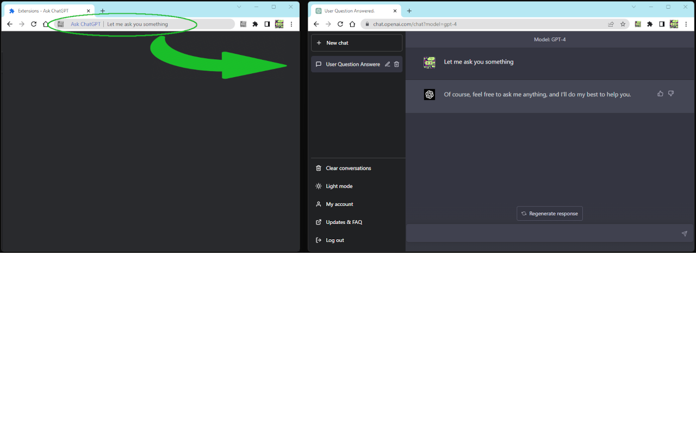
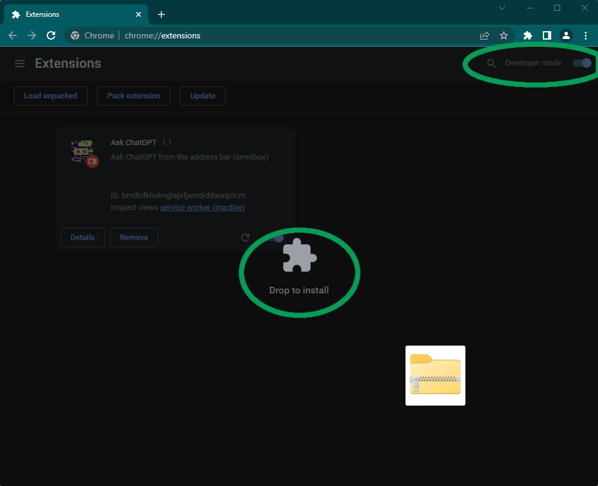

# GPT searchline

Ask ChatGPT directly from the address bar.

# Installation

This extension is not yet available in the Chrome Web Store (approval pending). In the meantime, you can install it manually:

1. Download the [latest release](https://github.com/IgorDuino/gpt-searchlin/releases/latest) (gpt-chrome.zip).
2. Open the [Extensions](chrome://extensions) page.
3. Enable "Developer mode" (top right).
4. Drag the zip file onto the page to install.

